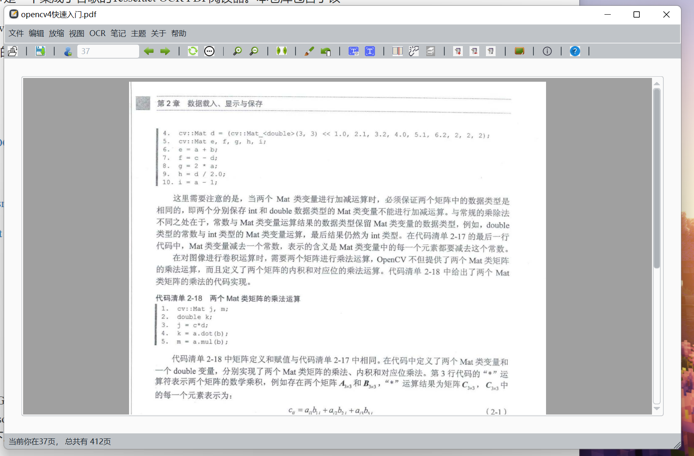
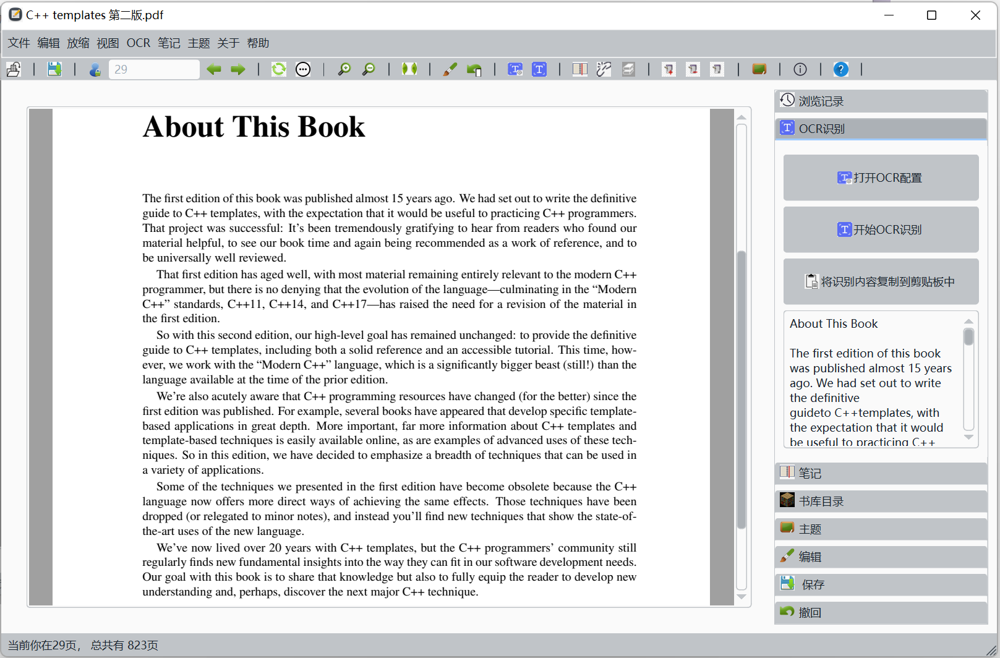

# CCPDF_View 2.0

## Intro's

​	This is the repo for CCPDF_View, a PDF Reader contains Tesseract OCR. Incluings are the releases that is at least portable in Windows 10 and Window 11(Sadly, Linux Version is required to compile by yourself :( )

​	CCPDF_View is free toaccess by anyone who want's to use it. The base sources are

>  OCR：Tesseract5：
>
> [tesseract-ocr/tesseract: Tesseract Open Source OCR Engine (main repository) (github.com)](https://github.com/tesseract-ocr/tesseract)
>
> Styles：
>
> `[QDarkStyle]:`https://github.com/ColinDuquesnoy/QDarkStyleSheet
>
> `[QSS]:` https://github.com/GTRONICK/QSS.git
>
> PDF Reading Core:
>
> QPDF[Qt PDF](https://doc.qt.io/qt-6/qtpdf-index.html)

​	click these links for learning more about them!

## Compiles

> In Windows, what you need is to use Mingw73_64 Or MSVC19 to Compile the Project. The Execution requires the Private Sources libOCRPack, the source is a lib given in the ./sources/OCRPack/, what you are supposed to do at first is to modify according to your need, compile it to the DEBUG/Releasing lib, put it in the ./source/CCPDF_View/ocr/libs, the linking step accuires the lib in such a path.

## Releases v1.0

​	This is the first Published Releaseed Edtion of CCPDF_View

​	In Currrent Version, It at least suppport:

> 1. Load PDF through dragging into the Window, Opening by accessing the menu, or selecting in the Book Model Directories.
> 2. Owns a history recorder to record what have you read previously
> 3. Friendly(If it is) fast jump and Page Index reminder
> 4. OCR Services based on Google Tesseract
> 5. Bind each PDF with a note with any format and freely set how to open it
> 6. Set the Book Model at one time and make it easy to access PDF with a PDF-densed directories
> 7. Themes! Random Themes!
> 8. Editing a PDF Somehow... At least Commenting and marking!
> 9. Export the edited PDF
> 10. Support Resuming and cancel the Resuming
> 11. Mutli-Key-Sequence Operating
>
> For more, access to the helping Windows
