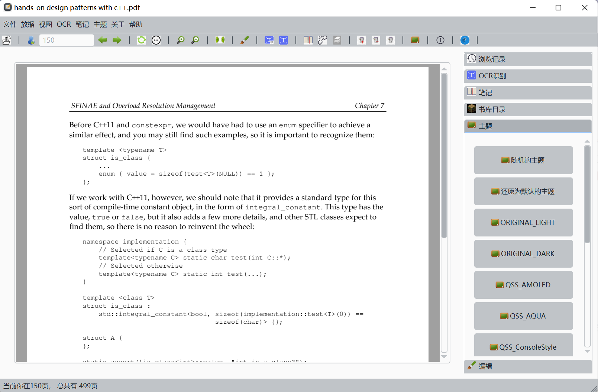

# CCPDF_View

## Intro's

​	This is the repo for CCPDF_View, a PDF Reader contains Tesseract OCR. Incluings are the releases that is at least portable in Windows 10 and Window 11(Sadly, Linux Version is required to compile by yourself :( )

​	CCPDF_View is free toaccess by anyone who want's to use it. The base sources are

>  OCR：Tesseract5：
>
> [tesseract-ocr/tesseract: Tesseract Open Source OCR Engine (main repository) (github.com)](https://github.com/tesseract-ocr/tesseract)
>
> Styles：
>
> `[QDarkStyle]:`https://github.com/ColinDuquesnoy/QDarkStyleSheet
>
> `[QSS]:` https://github.com/GTRONICK/QSS.git
>
> PDF Reading Core:
>
> QPDF[Qt PDF](https://doc.qt.io/qt-6/qtpdf-index.html)

​	click these links for learning more about them!

## Compiles

> In Windows, what you need is to use Mingw73_64 Or MSVC19 to Compile the Project. The Execution requires the Private Sources libOCRPack, the source is a lib given in the ./sources/OCRPack/, what you are supposed to do at first is to modify according to your need, compile it to the DEBUG/Releasing lib, put it in the ./source/CCPDF_View/ocr/libs, the linking step accuires the lib in such a path.

## Releases

> View the help window in the executions. (Too lazy to write the intros lol)

