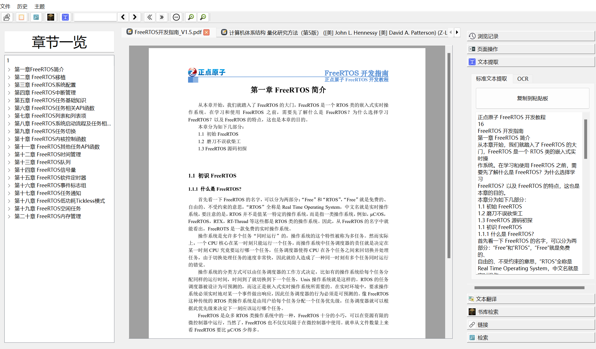

# README

CCPDFView_Seta is a concise lightweight PDF reader program that is currently in the testing phase.

## Update 3

- Support Optional Compile of Reading PDF, the Sources are from your Computer Default''s TTSs
- Support Multi-Thread Compilitions for MSVC, for Makefile user, you can set threads cnt by offering -j params in project settings
- More Tidy Codes by clang-format
- Update Showing strings in TranslationWidget

## Update 2 

- attempts to support some animations 
- command line launch of this PDF application: currently supports adding PDF list parameters to open PDF

## Update 1

Updates:

- Added shortcut key help (introduce shortcut keys)
- Add the function of hiding the menu bar and translation bar
- Completed some shortcut keys for operations (refer to shortcut key help for details)

## Functionalities Current

### Currently supported features:

> Reading:
>
> > Basic PDF page redirection, reading navigation
> >
> > Memory Functionalities supported by logging automatically locates the last browsing location for documents that the user has not closed next time they open them
>
> Basic Zooming
>
> > Support Zoom in and Zoom Out 
> >
> > Support Mouse Dragging when PDF is zooming in a relavent large case
>
> PDF Service
>
> > Parse native PDF bookmarks and support jumping by double-clicking for quick browsing of chapters
> >
> > native text information extraction for Non image rendering based PDF supports!
> >
> > Support internal PDF retrieval and model redirection
> >
> > Support identifying internal links in PDF and clicking to redirect
>
> PDF Library
>
> >Support library browsing, easily navigate through all PDF programs in one folder within the program
> >
> >Support searching for PDF titles in a given directory
>
> Plugin operation:
>
> >Support the use of Tesseract OCR plugin and TesseractWrapper.dll associated with the project as compatibility support for DLL plugin
> >
> >Supporting user side free translation program compatibility, users only need to provide a translation EXE file and meet the file name specification to use the translation plugin inside the program
> >
> >Support Auto Run For Translations,When you browse the PDF up and down, the software will automatically trigger the call to the plugin program according to the page changes! no matter if is MultiPage or SinglePage
>
> Qt Theme Free Registration:
>
> >Support the use of all Qt themes with QSS format. Users only need to specify the QSS file of the theme to load it and remember it until it is deleted by the user.
>
> MultiPage Supports:
>
> > Users now can browse PDF In MutiPage
